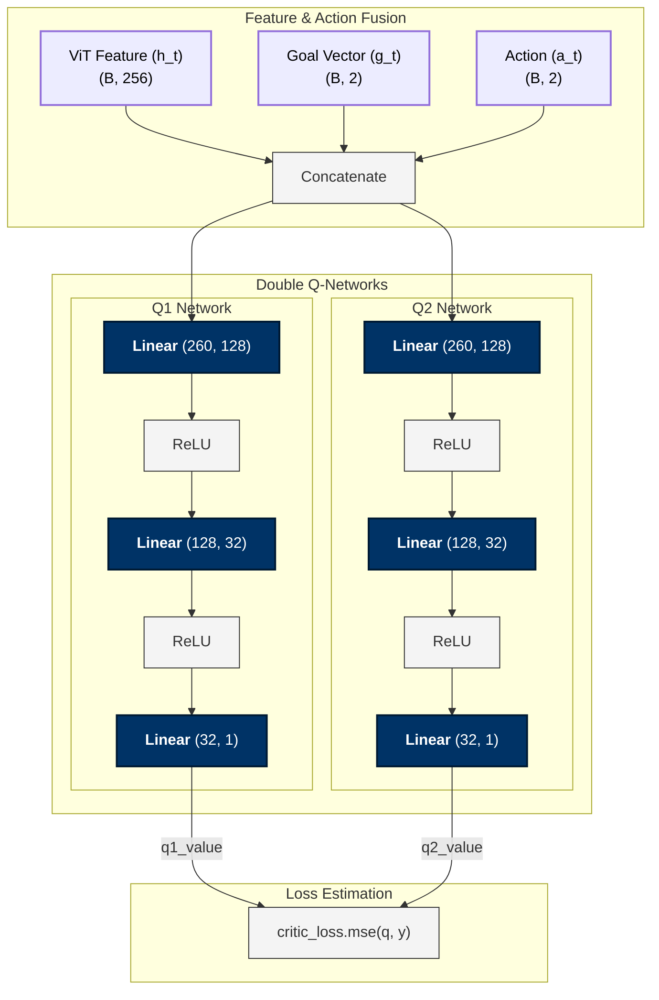
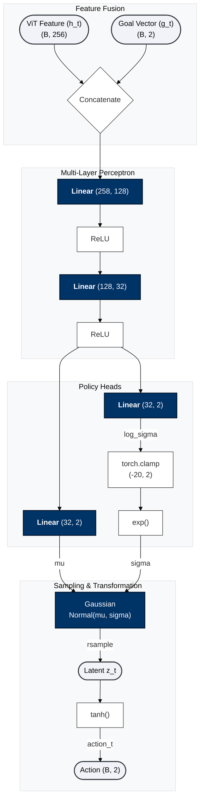
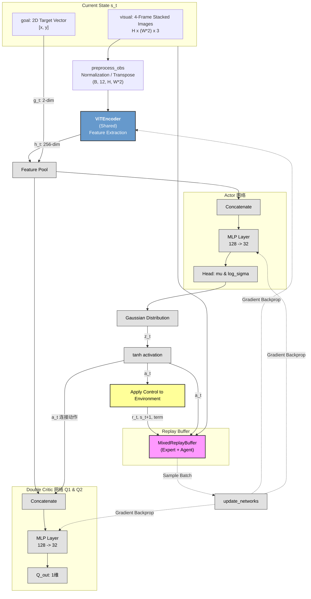

# Double Critic

```mermaid
graph TD
    %% Optimized Color Palette
    classDef data fill:#ececff,stroke:#9370db,stroke-width:2px,color:#000;
    classDef layer fill:#003366,stroke:#001a33,stroke-width:2px,color:#fff;
    classDef proc fill:#f4f4f4,stroke:#333,stroke-width:1px,color:#333;

    %% Input State & Action
    subgraph Critic_Inputs ["Feature & Action Fusion"]
        H["ViT Feature (h_t)<br/>(B, 256)"]:::data
        G["Goal Vector (g_t)<br/>(B, 2)"]:::data
        A["Action (a_t)<br/>(B, 2)"]:::data
        CAT[Concatenate]:::proc
        
        H --> CAT
        G --> CAT
        A --> CAT
    end

    %% Double Q-Network Backbone
    subgraph Double_Critic ["Double Q-Networks"]
        
        subgraph Critic_Q1 ["Q1 Network"]
            Q1_FC1["<b>Linear</b> (260, 128)"]:::layer
            Q1_RELU1[ReLU]:::proc
            Q1_FC2["<b>Linear</b> (128, 32)"]:::layer
            Q1_RELU2[ReLU]:::proc
            Q1_OUT["<b>Linear</b> (32, 1)"]:::layer
            
            Q1_FC1 --> Q1_RELU1 --> Q1_FC2 --> Q1_RELU2 --> Q1_OUT
        end

        subgraph Critic_Q2 ["Q2 Network"]
            Q2_FC1["<b>Linear</b> (260, 128)"]:::layer
            Q2_RELU1[ReLU]:::proc
            Q2_FC2["<b>Linear</b> (128, 32)"]:::layer
            Q2_RELU2[ReLU]:::proc
            Q2_OUT["<b>Linear</b> (32, 1)"]:::layer
            
            Q2_FC1 --> Q2_RELU1 --> Q2_FC2 --> Q2_RELU2 --> Q2_OUT
        end
        
        CAT --> Q1_FC1
        CAT --> Q2_FC1
    end

    %% Final Q-Value Outputs
    subgraph Critic_Outputs ["Loss Estimation"]
        Q1_OUT -->|q1_value| FINAL["critic_loss.mse(q, y)"]:::proc
        Q2_OUT -->|q2_value| FINAL
    end
```

# Actor

```mermaid
%%{init: {'theme': 'base', 'themeVariables': { 'primaryColor': '#ffffff', 'edgeLabelBackground':'#ffffff', 'tertiaryColor': '#f8f9fa' }}}%%
graph TD
    %% Style Definitions (Professional Academic Palette)
    classDef data fill:#f1f3f9,stroke:#343a40,stroke-width:2px,color:#000;
    classDef layer fill:#003366,stroke:#001a33,stroke-width:2px,color:#fff;
    classDef proc fill:#ffffff,stroke:#333,stroke-width:1px,color:#333;

    %% Input Features
    subgraph Actor_Inputs ["Feature Fusion"]
        H(["ViT Feature (h_t)<br/>(B, 256)"]):::data
        G(["Goal Vector (g_t)<br/>(B, 2)"]):::data
        CAT{Concatenate}:::proc
        
        H --> CAT
        G --> CAT
    end

    %% Backbone MLP
    subgraph Actor_MLP ["Multi-Layer Perceptron"]
        FC1["<b>Linear</b> (258, 128)"]:::layer
        RELU1[ReLU]:::proc
        FC2["<b>Linear</b> (128, 32)"]:::layer
        RELU2[ReLU]:::proc
        
        CAT --> FC1
        FC1 --> RELU1
        RELU1 --> FC2
        FC2 --> RELU2
    end
    
    %% Gaussian Policy Heads
    subgraph Actor_Heads ["Policy Heads"]
        MU_FC["<b>Linear</b> (32, 2)"]:::layer
        SIGMA_FC["<b>Linear</b> (32, 2)"]:::layer
        CLAMP["torch.clamp<br/>(-20, 2)"]:::proc
        EXP["exp()"]:::proc

        RELU2 --> MU_FC
        RELU2 --> SIGMA_FC
        SIGMA_FC -->|log_sigma| CLAMP
        CLAMP --> EXP
    end

    %% Final Output & Sampling
    subgraph Sampling ["Sampling & Transformation"]
        DIST["Gaussian<br/>Normal(mu, sigma)"]:::layer
        Z(["Latent z_t"]):::data
        TANH["tanh()"]:::proc
        ACTION(["Action (B, 2)"]):::data

        MU_FC -->|mu| DIST
        EXP -->|sigma| DIST
        DIST -->|rsample| Z
        Z --> TANH
        TANH -->|action_t| ACTION
    end
```

# ViT

```mermaid
graph LR
    %% 定义样式
    classDef data fill:#e1e1e1,stroke:#333,stroke-width:1px,color:black;
    classDef layer fill:#69c,stroke:#333,stroke-width:2px,color:white;
    classDef proc fill:#f9f,stroke:#333,stroke-width:1px,color:black;

    IN["输入图像<br/>(B, 12, 84, 168)"]:::data

    PE["<b>Patch Embedding</b><br/>Conv2d(12, 256, kernel=16, stride=16)<br/>Flatten & Transpose"]:::layer
    POS["<b>Position Embedding</b><br/>(Learnable)"]:::data
    ADD[Add]:::proc
    
    IN --> PE
    PE --> ADD
    POS --> ADD
    
    %% 核心修正：移除引号，确保括号前后有空格
    ADD -->| Sequence - B, Sequence_Len, 256 | TB_START[::]:::layer
    
    subgraph Transformer_Blocks ["Transformer Blocks (Depth=2)"]
        LN1[LayerNorm]:::proc
        MHA["<b>Multi-Head Attention</b><br/>(Heads=4, Dim=256)"]:::layer
        LN2[LayerNorm]:::proc
        MLP["<b>MLP</b><br/>FC -> GELU -> FC<br/>256 -> 1024 -> 256"]:::layer
        RES1[Residual Add]:::proc
        RES2[Residual Add]:::proc
        
        LN1 --> MHA
        LN1 -.-> RES1
        MHA --> RES1
        
        RES1 --> LN2
        LN2 --> MLP
        LN2 -.-> RES2
        MLP --> RES2
        
        RES2 -->| Output to next block | TB_END[::]:::layer
    end
    
    TB_START --> LN1
    
    TB_END -->| Sequence Output | CLS["<b>CLS Token</b><br/>(or mean pooling)"]:::layer
    CLS -->| Final Feature | OUT["h_t: 256维"]:::data
```

# Overview

```mermaid
graph TD
    %% 定义样式
    classDef storage fill:#f9f,stroke:#333,stroke-width:2px,color:black;
    classDef network fill:#69c,stroke:#333,stroke-width:2px,color:white;
    classDef env fill:#ff9,stroke:#333,stroke-width:2px,color:black;
    classDef proc fill:#e1e1e1,stroke:#333,stroke-width:1px,color:black;

    %% 输入数据
    subgraph Input_State [Current State s_t]
        IMG["visual: 4-Frame Stacked Images<br/>H x (W*2) x 3"]
        GOAL["goal: 2D Target Vector<br/>[x, y]"]
    end

    %% 预处理
    PRE["preprocess_obs<br/>Normalization / Transpose<br/>(B, 12, H, W*2)"]
    
    IMG --> PRE
    
    %% 共享编码器
    SHARED_VIT["<b>ViTEncoder</b><br/>(Shared)<br/>Feature Extraction"]:::network
    
    PRE --> SHARED_VIT
    SHARED_VIT -->|h_t: 256-dim| FEAT_POOL[Feature Pool]:::proc
    GOAL -->|g_t: 2-dim| FEAT_POOL

    %% Actor 网络
    subgraph Actor_Net [Actor 网络]
        A_CAT[Concatenate]:::proc
        A_MLP["MLP Layer<br/>128 -> 32"]:::proc
        A_HEADS["Head: mu & log_sigma"]:::proc
        
        A_CAT --> A_MLP --> A_HEADS
    end
    
    FEAT_POOL --> A_CAT

    %% 采样与动作
    GAUSSIAN[Gaussian Distribution]:::proc
    TANH[tanh activation]:::proc
    
    A_HEADS --> GAUSSIAN -->|z_t| TANH -->|a_t| ENV_STEP["Apply Control to Environment"]:::env

    %% Critic 网络
    subgraph Double_Critic_Net [Double Critic 网络 Q1 & Q2]
        C_CAT[Concatenate]:::proc
        C_MLP["MLP Layer<br/>128 -> 32"]:::proc
        C_OUT["Q_out: 1维"]:::proc
        
        C_CAT --> C_MLP --> C_OUT
    end
    
    FEAT_POOL --> C_CAT
    TANH -->|a_t 连接动作| C_CAT

    %% 经验回放
    subgraph Replay_System [Replay Buffer]
        RB["MixedReplayBuffer<br/>(Expert + Agent)"]:::storage
    end
    
    ENV_STEP -->|r_t, s_t+1, term| RB
    TANH -->|a_t| RB
    Input_State --> RB
    
    %% 更新连接
    RB -.->|Sample Batch| UPDATE[update_networks]:::proc
    UPDATE -.->|Gradient Backprop| SHARED_VIT
    UPDATE -.->|Gradient Backprop| A_MLP
    UPDATE -.->|Gradient Backprop| C_MLP
```
